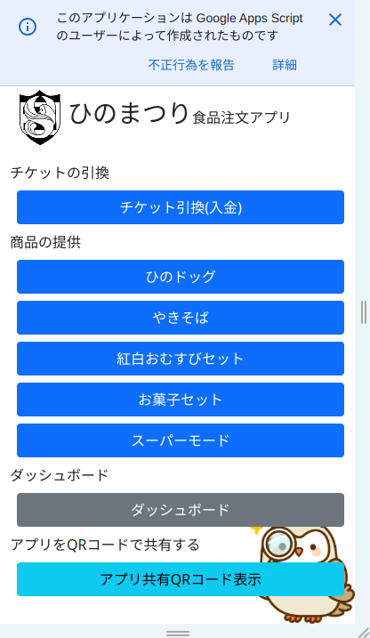
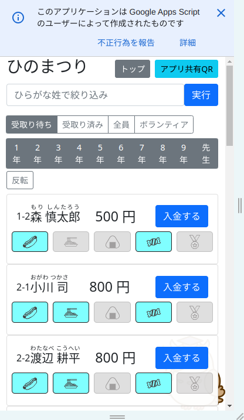
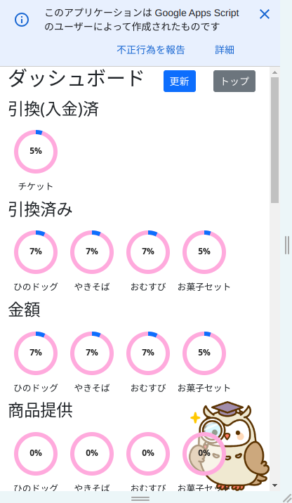
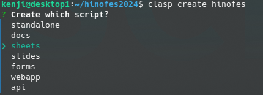
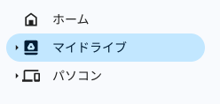
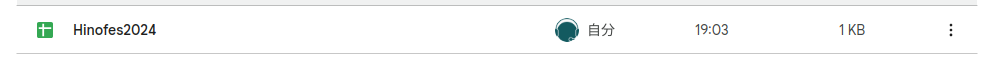
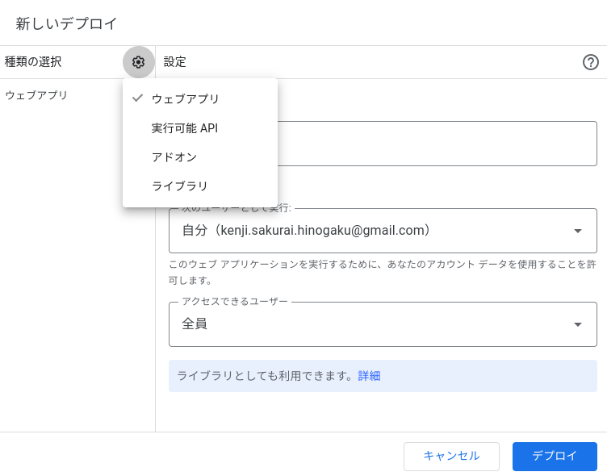
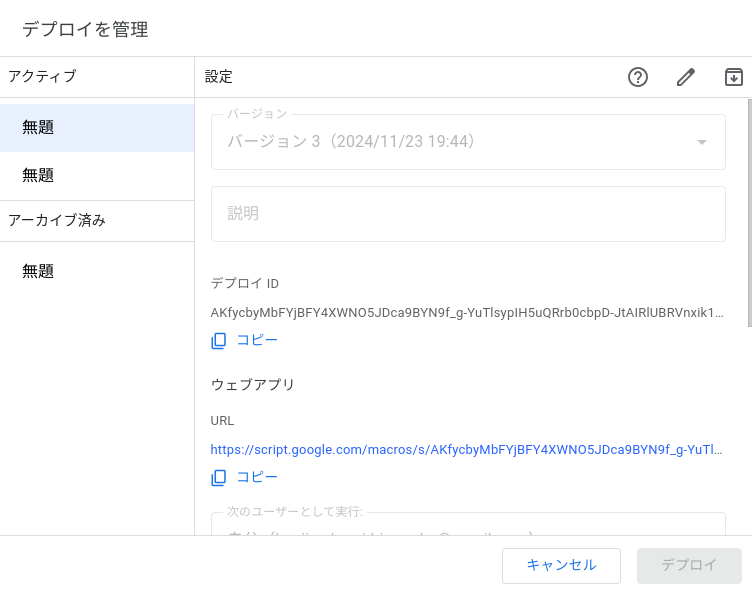

# ひのまつりアプリ

2024年のひのまつりで使用した、食品のチケット交換と食品提供を管理するアプリ

食品は事前申込制で、事前に申し込みされた方にチケットを渡す際と、
チケットを忘れた方に商品を渡す際に使用しました。



### 主な使用方法

名前の姓のひらがなで検索し、対象の方が表示されたら「入金する」ボタンを押します。

これによりチケットを渡した履歴を記録できます。



### ダッシュボード

Google spreadsheetの「サマリ」シートに記載された内容が表示されます。

シート上で集計情報を作成するとアプリの画面にそのまま表示されます。




## 使用方法

### 必要なツール

- vscode
- docker
- git

### 再現手順

#### 概要

リポジトリをクローンして、Google Apps Script にプッシュして、GAS画面からデプロイ

#### 手順


リポジトリをクローンしできたディレクトリに移動する

```
git clone https://github.com/ECR33/hinofes2024.git

cd hinofes2024
```

GASにログインして環境を整える。いろいろ聞かれるので指示に従って。

```
clasp login
```

GASプロジェクトを作成する

```
clasp create hinofes
```

選択肢が出るのでsheetsを選択しておく



この時点で以下のファイルが作成される。
- .clasp.json
- appsscript.json


Googleドライブにはマイドライブにフォルダ名と同じ名称のファイルができる





できたシートにテンプレートをコピーする

このファイルの内容を手作業でコピペ

- ひのまつり2024食券申込一覧.xlsx
  - 注文一覧
  - サマリ
  - 商品一覧
  - log

コードをGASにコピー

```
clasp push
```

GASエディタをブラウザで開く

```
clasp open
```

GASエディタ上でウェブアプリをデプロイする

- 「デプロイ」
- 「新しいデプロイ」
- ギアマークから「ウェブアプリ」
- 「アクセスできるユーザ」を「全員」



アプリの起動

「ウェブアプリ」のリンクをクリックするとアプリが起動



## 注意

表示されている氏名やサンプルデータの氏名はすべてランダムに生成した架空の氏名です。

## 参考

コマンドでデプロイする場合、デプロイIDを指定するとアプリのURLは変更されない。

```
clasp deploy -i AKfycbyMbFYjBFY4XWNO5JDca9BYN9f_g-YuTlsypIH5uQRrb0cbpD-JtAIRlUBRVnxik1Fa
```


